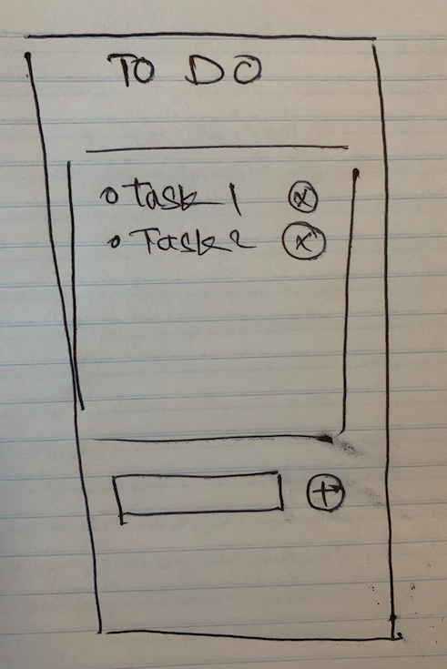

# To Do App

## What is we want to do?

- The ability to add a task
- The ability to remove a task

## What technologies we will use

- Html, Css and Js

## How it will look like?

## What are the task involved?

- Our Development Environment is setup

  - [ ] Remote Repo
  - [ ] Local Project Folder
  - [ ] Setup all extensions
  - [ ] Breaking down the design into smaller component

  - **HTML**

    - [ ] Header (title)
    - [ ] Section for task
    - [ ] List for items
    - [ ] Delete button
    - [ ] Input
    - [ ] Add button
    - [ ] Horizontal rule
    - [ ] Link Bootstrap CSS
    - [ ] Link Bootstrap JS
    - [ ] Link local style sheet
    - [ ] Link local scripts

  - **CSS - (Using Bootstrap)**

    - [ ] Container
    - [ ] Grid (Col x 1 and Row x 3)
    - [ ] Header class
    - [ ] Lists class
    - [ ] Horizontal rule
    - [ ] Input class
    - [ ] Label class
    - [ ] Button classes
    - [ ] Colors
    - [ ] Typography
    - [ ] Apply proper layout

  - **JavaScript**
    - [ ] Add functionality
    - [ ] Delete functionality

## What are the feature to do if we have time?

- [ ] Printing option
- [ ] Saving history, so on refresher the user doesn’t lose the to-do
- [ ] Add event for pressing enter to add task
